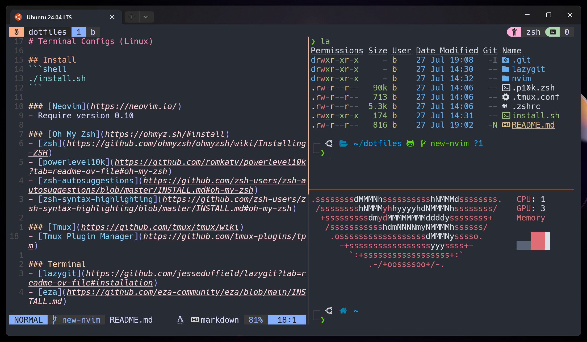

# Terminal Config (Linux)



## Requirements
- [Nerd Font (v3)](https://www.nerdfonts.com/)

## Install
```shell
./install.sh
```

### [Neovim](https://neovim.io/)
- Require version 0.10

### [Oh My Zsh](https://ohmyz.sh/#install)
- [zsh](https://github.com/ohmyzsh/ohmyzsh/wiki/Installing-ZSH)
- [powerlevel10k](https://github.com/romkatv/powerlevel10k?tab=readme-ov-file#oh-my-zsh)
- [zsh-autosuggestions](https://github.com/zsh-users/zsh-autosuggestions/blob/master/INSTALL.md#oh-my-zsh)
- [zsh-syntax-highlighting](https://github.com/zsh-users/zsh-syntax-highlighting/blob/master/INSTALL.md#oh-my-zsh)

### [Tmux](https://github.com/tmux/tmux/wiki)
- [Tmux Plugin Manager](https://github.com/tmux-plugins/tpm)

### Terminal
- [lazygit](https://github.com/jesseduffield/lazygit?tab=readme-ov-file#installation)
- [eza](https://github.com/eza-community/eza/blob/main/INSTALL.md)
